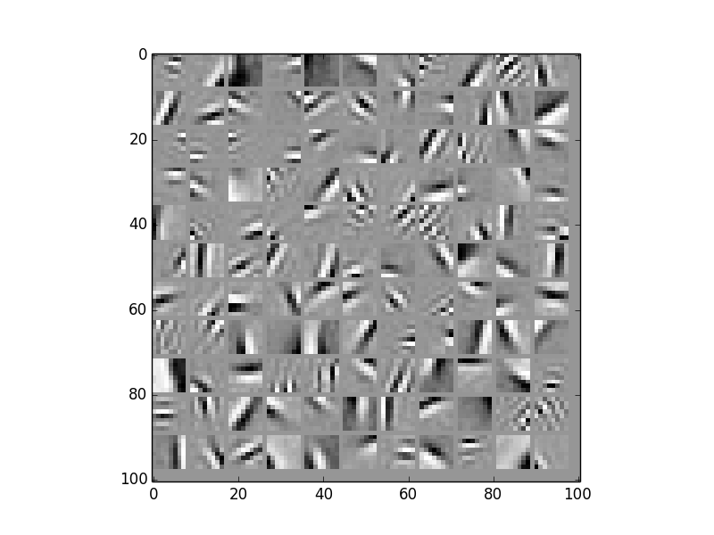

Python implementation of Sparsenet (1996 Olshausen & Field). Standard stochastic gradient descent to learn dictionary and multiple algorithms to infer coefficients. Minimizes the following objective function:

min_{\Phi, s} ||I - \Phi*s||^2 + ||s||_1 

I: Data
Phi: Learned dictionary
s: Coefficients  

L1 optimization solved using Locally Competitive Algorithm (LCA) (2006 Rozell et al.)  
L1 alternate optimization solved using Fast Iterative Shrinkage and Thresholding Algorithm (FISTA)  
L0 optimization solved using L1 Initialization and Iterative Hard Thresholding (2008 Blumensath & Davies) - To Do  

2x Overcomplete Dictionary Trained on Natural Image Patches

